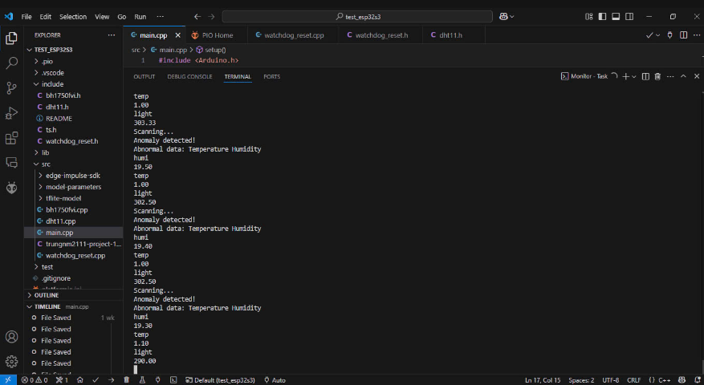

## 🛠 Tên Dự Án 

`Xây dựng hệ thống phát hiện bất thường của cảm biến dựa trên TinyML`

Người làm chính: Nguyễn Minh Trung-B21DCDT226

Đồ án này tập trung vào việc phát triển một hệ thống theo dõi và phát hiện những bất thường của các cảm biến nhiệt độ, độ ẩm và ánh sáng bằng ai sau đó cảnh báo cho người dùng.

## 🧰 Tổng quan về công nghệ và thư viện được dùng

•	ESP32-S3: ESP32-S3 là vi điều khiển mạnh mẽ với khả năng xử lý tín hiệu và hỗ trợ AI trực tiếp trên phần cứng. Với bộ vi xử lý này, hệ thống có thể thực hiện các tác vụ nhận diện giọng nói ngay trên thiết bị mà không cần kết nối đến máy chủ, giúp tiết kiệm băng thông và giảm độ trễ. Cùng với đó là các cảm biến sử dụng: cảm biến nhiệt độ, độ ẩm dht11, cảm biến ánh sáng bh1750.

•	Edge Impulse: Edge Impulse là một nền tảng cho phép phát triển và huấn luyện các mô hình TinyML. Nền tảng này hỗ trợ thu thập dữ liệu, xử lý tín hiệu, huấn luyện mô hình và triển khai mô hình lên các thiết bị nhúng một cách dễ dàng và hiệu quả.

•	K-Means: K-Means là một thuật toán học không giám sát phổ biến trong học máy, được sử dụng để phân cụm dữ liệu. Thuật toán này nhóm các điểm dữ liệu thành k cụm dựa trên sự tương đồng về khoảng cách (thường là khoảng cách Euclidean). K-Means bắt đầu bằng cách chọn ngẫu nhiên k tâm cụm, sau đó lặp lại hai bước: gán mỗi điểm dữ liệu vào cụm gần nhất và cập nhật tâm cụm dựa trên trung bình các điểm trong cụm. Quá trình này tiếp tục cho đến khi các tâm cụm không thay đổi đáng kể hoặc đạt số vòng lặp tối đa. K-Means thường được sử dụng trong phân tích dữ liệu, nhận diện mẫu và xử lý ảnh.

•	Arduino trên VS Code với PlatformIO: Môi trường phát triển này cung cấp một nền tảng lập trình quen thuộc và mạnh mẽ cho việc phát triển ứng dụng trên ESP32-S3. Nó hỗ trợ nhiều thư viện và công cụ cần thiết để lập trình và tương tác với phần cứng một cách dễ dàng.


## Kết quả 




## 💻 Lập Trình

Ngôn ngữ: PlatformIO

Cách build:
```bash
platformio run
```
Cách upload: 
```bash 
platformio run --target upload
```

cách bật monitor:
```bash 
platformio device monitor
```


